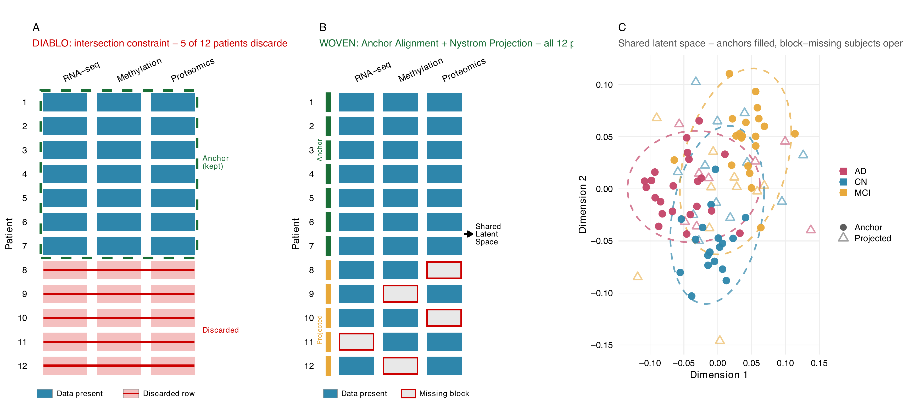
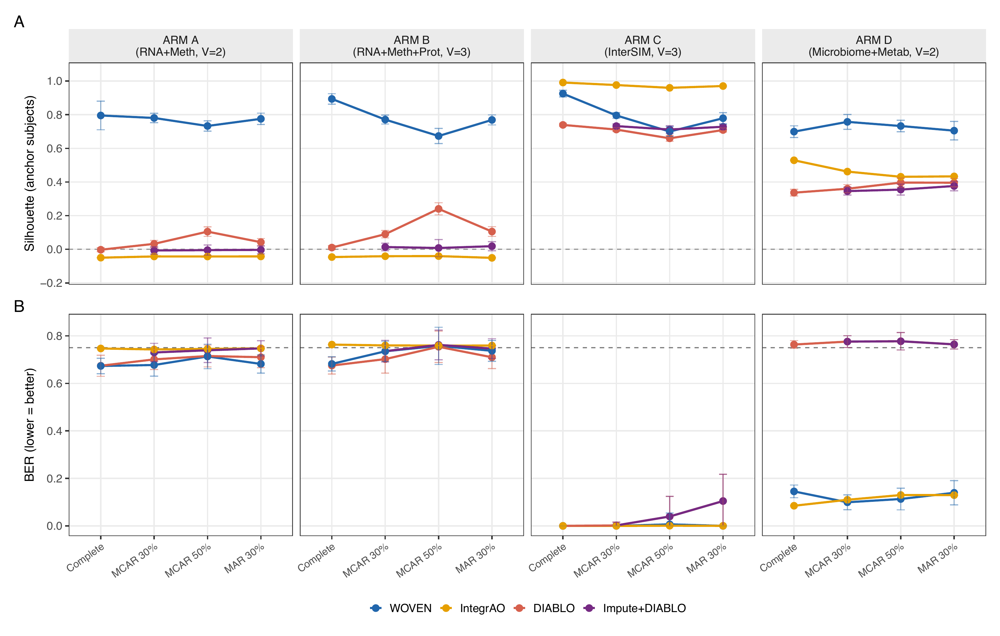
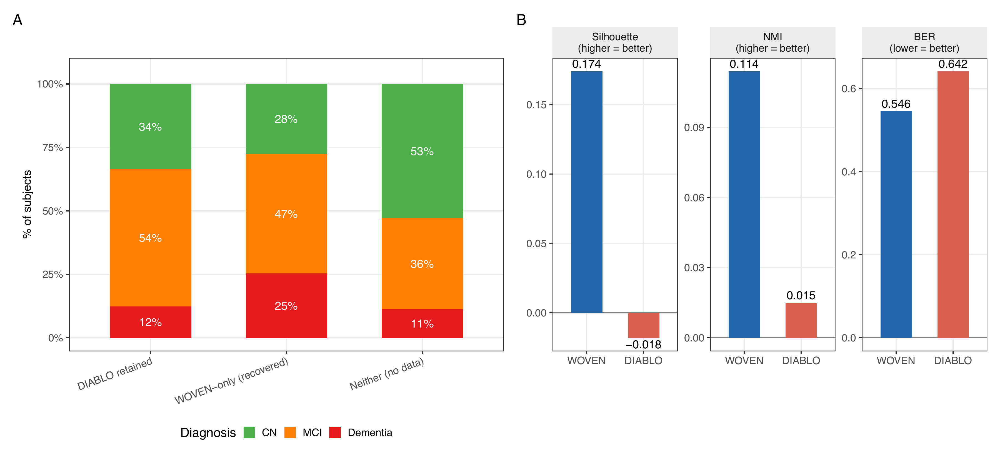

# Weighted Omics View Embedding via Nystrom (WOVEN): Supervised Multi-Omics Integration for Block-Missing Clinical Cohort Data

**Nathan Bresette**^1,2^, **Brayden Schulze**^1^, **Jacob Barron**^3^, **Jianlin Cheng**^4^ and **Ai-Ling Lin**^1,2,5^

^1^ NextGen Precision Health Institute, University of Missouri, Columbia, Missouri, USA\
^2^ Institute for Data Science and Informatics, University of Missouri, Columbia, Missouri, USA\
^3^ Washington University in St. Louis, St. Louis, Missouri, USA\
^4^ Department of Electrical Engineering and Computer Science, University of Missouri, Columbia, Missouri, USA\
^5^ Department of Radiology, University of Missouri, Columbia, Missouri, USA

Correspondence: ai-ling.lin\@health.missouri.edu

## Abstract

**Motivation:** Supervised multi-omics integration enforces a complete-case constraint, silently discarding patients missing any modality. When missingness correlates with disease severity, complete-case analysis can exclude the most affected patients and bias downstream inference.

**Results:** We present WOVEN (Weighted Omics View Embedding via Nystrom), which learns a shared supervised latent space from fully observed anchor subjects and projects incomplete patients by a linear out-of-sample (Nystrom) extension without feature-level imputation. Across 400 simulation replicates, WOVEN retains 100% of subjects at 50% block-missingness versus 19% for complete-case supervised methods, achieves three-fold higher silhouette on complete data, and lower classification error on compositional microbiome-metabolomics data. Feature-level imputation before integration does not recover lost cross-modal structure. Applied to 2,422 ADNI subjects combining MRI, lipidomics, and metabolomics, WOVEN scores 70% of patients versus 31%; recovered patients show 25% dementia prevalence versus 12%.

**Availability:** R package: https://github.com/NathanBresette/woven (Bioconductor submission in progress). Benchmark: https://github.com/NathanBresette/woven_paper.

## 1. Introduction

*1. The Context and The Bottleneck*

*2. The Gap in Existing Tools*

*3. The Proposed Method*

*4. The Validation Summary*

## 2. Methods

### 2.1 Problem Formulation

Let $X^{(v)} \in \mathbb{R}^{n \times p_v}$ denote the data matrix for modality $v \in \{1, \ldots, V\}$ over $n$ subjects. Under block-missing data, subject $i$ may be entirely absent from modality $v$. Let $\mathcal{A} \subseteq \{1, \ldots, n\}$ denote the anchor set, the subjects with observations in all $V$ modalities, with $n_a = |\mathcal{A}|$, and let $X_a^{(v)} \in \mathbb{R}^{n_a \times p_v}$ denote the restriction of $X^{(v)}$ to anchor rows. Non-anchor subjects have data in at least one but not all modalities. Subjects with no data in any modality are excluded. Let $Y \in \{1, \ldots, C\}^n$ denote the vector of class labels and $K \leq n_a$ the number of latent dimensions.

WOVEN seeks projection matrices $W^{(v)} \in \mathbb{R}^{p_v \times K}$ for each modality such that the anchor latent scores $Z_a^{(v)} = X_a^{(v)} W^{(v)}$ are maximally correlated across modalities, geometrically regularized within each modality, and discriminative with respect to $Y$.

### 2.2 Objective Function

The WOVEN objective is a label-augmented multiset canonical correlation analysis (MCCA), the multiview extension of canonical correlation analysis (CCA), maximizing a sum-of-correlations (SUMCOR) criterion:

$$\max_{W^{(v)}} \sum_{v < u} \text{tr}\left( W^{(v)T} \tilde{C}_{vu} W^{(u)} \right) \quad \text{s.t.} \quad W^{(v)T} B_v W^{(v)} = I_K$$

where $\tilde{C}_{vu} = X_a^{(v)T} \left( I + \gamma_Y K_Y \right) X_a^{(u)}$ is the label-augmented cross-covariance restricted to anchor subjects, $\tilde{Y} \in \mathbb{R}^{n_a \times C}$ is the column-centered indicator matrix of anchor class labels, $K_Y = \tilde{Y}\tilde{Y}^T / n_a$ is the resulting label kernel (entries large when subjects share the same class, zero-mean otherwise), and $\gamma_Y \geq 0$ is the supervision strength hyperparameter.

The constraint matrix $B_v = X_a^{(v)T} M_v X_a^{(v)}$ encodes graph Laplacian regularization, which preserves local neighborhood geometry in the learned embedding (Belkin and Niyogi, 2003), via $M_v = I_{n_a} + \lambda_v L_a^{(v)} / n_a$, where $L_a^{(v)}$ is the $n_a \times n_a$ anchor submatrix of a $k$-nearest-neighbor radial basis function (RBF) graph Laplacian built from all observed rows of $X^{(v)}$ (block-missing subjects excluded from the $k$-NN graph, no imputation). Restricting $B_v$ to the anchor block ensures that non-anchor subjects do not contribute to parameter estimation; the graph is still built on the full observed cohort, preserving neighborhood structure across all available data.

### 2.3 Closed-Form Solution via Dual MCCA

The WOVEN objective is reformulated in dual (sample) space using $M_v$ and its symmetric square root $M_v^{1/2}$ as defined in Section 2.2, enabling a single eigendecomposition of a $(V n_a) \times (V n_a)$ block matrix. The dual block matrix $P$ has zero diagonal blocks and off-diagonal blocks:

$$P_{vu} = M_v^{-1/2} \left( I + \gamma_Y K_Y \right) M_u^{-1/2}$$

The top-$K$ eigenvectors of $P$ (positive eigenvalues only), partitioned into $V$ blocks $\Phi_v \in \mathbb{R}^{n_a \times K}$, give M-orthonormalized anchor latent scores $Z_v = M_v^{-1/2} \Phi_v$; projection matrices are then recovered as $W^{(v)} = X_a^{(v)T} (X_a^{(v)} X_a^{(v)T} + \epsilon I)^{-1} Z_v$, with a small ridge $\epsilon > 0$ for numerical stability. The eigendecomposition is $O((V n_a)^3)$, and setting $\gamma_Y = 0$ recovers unsupervised SUMCOR MCCA. The full derivation, the M-orthonormalization, the reduction to dual supervised CCA at $V = 2$, and the treatment of the ridge and of negative eigenvalues are given in Supplementary Methods S2.

### 2.4 Projection of Block-Missing Subjects

All non-anchor subjects, regardless of how many modalities are observed, are projected into the latent space via linear out-of-sample extension using the estimated projection matrices:

$$\hat{z}_i = \frac{1}{|\mathcal{V}_i|} \sum_{v \in \mathcal{V}_i} x_i^{(v)} W^{(v)}$$

where $\mathcal{V}_i$ is the set of observed modalities for subject $i$ and $|\mathcal{V}_i| \geq 1$. Absent modalities contribute nothing to $\hat{z}_i$; no feature-level imputation is performed. For subjects with a single observed modality, the formula reduces to $\hat{z}_i = x_i^{(v)} W^{(v)}$. The application of estimated projection matrices to out-of-sample subjects follows the Nystrom out-of-sample extension framework (Bengio *et al.*, 2003), wherein $W^{(v)}$ learned from anchor subjects serves as the linear operator mapping new observations into the anchor latent space. For linear embeddings such as those in the CCA family, this out-of-sample extension reduces exactly to applying the learned projection operator to new feature vectors, requiring no kernel evaluation against anchor subjects.

**Algorithm 1 (WOVEN).** *Input:* per-modality matrices $X^{(v)}$, labels $Y$, anchor set $\mathcal{A}$, latent dimension $K$, hyperparameters $\lambda_v, \gamma_Y, k$.

1. Build a $k$-NN RBF graph Laplacian $L^{(v)}$ on the observed rows of each modality (block-missing subjects excluded); form $M_v = I + \lambda_v L_a^{(v)}/n_a$ on the anchor block.
2. Form the label kernel $K_Y$ from anchor labels and assemble the dual block matrix $P$ with off-diagonal blocks $M_v^{-1/2}(I + \gamma_Y K_Y)M_u^{-1/2}$ and zero diagonal blocks.
3. Take the top-$K$ positive eigenvectors of $P$; the $v$-th block gives anchor latent scores $Z_v$ (M-orthonormalized).
4. Recover projection matrices $W^{(v)} = X_a^{(v)T}(X_a^{(v)} X_a^{(v)T} + \epsilon I)^{-1} Z_v$.
5. Project each non-anchor subject as the mean of $x_i^{(v)} W^{(v)}$ over its observed modalities.

*Output:* projection matrices $W^{(v)}$ and latent scores for all subjects.

### 2.5 Hyperparameter Selection

The supervision strength $\gamma_Y$ is selected from $\{0.5, 1.0, 5.0, 10.0\}$ and the regularization strength $\lambda_v$ from $\{0.001, 0.005, 0.01, 0.1, 0.5\}$ by three-fold stratified cross-validation on anchor subjects, maximizing silhouette score (Rousseeuw, 1987) of held-out anchor latent scores. The $k$-NN graph uses $k = 10$ by default; sensitivity analysis across $k \in \{3, 5, 10, 20, 50\}$ shows silhouette varies by less than 0.044 across this range. Sensitivity to $\lambda$ across four orders of magnitude ($10^{-4}$ to $1.0$) changes silhouette by less than 1%, and any $\gamma_Y > 0$ recovers full performance (setting $\gamma_Y = 0$ degrades silhouette from 0.799 to -0.094, confirming that the supervision term is essential). Given this stability, the R package defaults to these values ($k = 10$, $\lambda_v = 0.1$, $\gamma_Y = 1$), so cross-validation is optional rather than required for routine use.

### 2.6 Simulation Design

All benchmark data are semi-synthetic: distributional parameters were estimated from real reference datasets before WOVEN was developed, so the simulation is independent of method construction (Sankaran *et al.*, 2025). Each arm has $n = 300$ subjects in four balanced groups of 75, with a shared $K = 5$ latent-factor ground truth embedded across modalities by SUMO (Osang'ir *et al.*, 2025) for evaluating latent-space recovery. Four arms span distinct signal regimes (full simulator specifications in Supplementary Methods S1):

- **ARM A** (RNA-seq + methylation, $V = 2$): diffuse signal; no single modality cleanly separates the four groups. 4,047 genes (SPsimSeq; Assefa *et al.*, 2020) and 367 CpG sites (InterSIM; Chalise *et al.*, 2016).
- **ARM B** (RNA-seq + methylation + proteomics, $V = 3$): diffuse signal extended with 62 proteins; the third modality lowers the anchor fraction to approximately 13% at 50% missing completely at random (MCAR).
- **ARM C** (RNA-seq + methylation + proteomics, $V = 3$): concentrated signal with strong between-group separation, where any reasonable method should succeed.
- **ARM D** (microbiome + metabolomics, $V = 2$): compositional, zero-inflated signal with spiked-in cross-modal associations (MIDASim, He *et al.*, 2024; NorTA, Mangnier *et al.*, 2025; SparseDOSSA2, Ma *et al.*, 2021); microbiome features are centered log-ratio (CLR) transformed (Aitchison, 1982).

Block missingness is induced post-simulation (Rubin, 1976): entire modality blocks are removed per subject at MCAR 30%, MCAR 50%, and structured missing at random (MAR; missingness probability correlated with group label), with every subject retaining at least one observed modality. One hundred independent replicates per arm yield 400 total per method per condition. In every replicate the anchor set (subjects observed in all $V$ modalities) is the training set: under MCAR 50%, anchor fractions are approximately 25% ($n_a \approx 75$, $V = 2$) and 13% ($n_a \approx 39$, $V = 3$). All projection matrices $W^{(v)}$ and hyperparameters are estimated from anchors alone; non-anchor subjects are scored after fitting. Simulation scripts are at https://github.com/NathanBresette/woven_paper.

### 2.7 Benchmark Evaluation Protocol

We evaluated WOVEN against DIABLO (Singh *et al.*, 2019; Rohart *et al.*, 2017), MOFA+ (multi-omics factor analysis; Argelaguet *et al.*, 2020), ImputeDIABLO (missForest random-forest imputation, Stekhoven and Bühlmann, 2012, followed by DIABLO), IntegrAO (Ma *et al.*, 2025), and dense DIABLO (DIABLO with sparsity constraint removed, evaluated on ARM D only to isolate whether DIABLO's disadvantage is algorithmic or a sparsity artifact). All methods were run with $K = 5$ latent dimensions. The benchmark structure, comparing integration methods across simulated multi-omics arms under controlled signal conditions, follows the design precedent of prior multi-omics integration comparisons (Duan *et al.*, 2021). The simulation parameters were fixed from real reference data before WOVEN was developed (Section 2.6), and the arms span both favorable and unfavorable regimes for WOVEN, from concentrated signal to diffuse-signal arms where no method exceeds chance, and from MCAR to MAR missingness where the anchor set is a biased subsample. ADNI (Section 2.8) serves as the independent test set.

Balanced error rate (BER) is computed via per-fold dimensionality reduction (DR) refitting with linear discriminant analysis (LDA), ensuring test subjects never contribute to parameter estimation; this avoids the circularity of fixed-Z BER for supervised methods. For IntegrAO, which produces graph embeddings rather than projection matrices, held-out subjects are projected via $k$-nearest-neighbor weighted average of training embeddings in feature space using available views, then classified by LDA, matching the per-fold DR refitting protocol used for all other methods. All methods use identical three-fold splits per replicate. Chance BER is 0.75 for four balanced classes. Latent space geometry is assessed using silhouette score (Rousseeuw, 1987) and normalized mutual information (NMI). For methods that score only a subset of subjects (DIABLO), full-cohort and anchor-only silhouette scores are both reported to enable fair comparison. All reported values are means across 100 replicates per arm; high cross-condition variability in BER reflects between-arm signal differences (ARM C: BER = 0.000 vs ARM A: BER $\approx$ 0.67) rather than estimation uncertainty. Per-arm standard deviations are provided in Supplementary Table S1. Differences between WOVEN and DIABLO were assessed by the Wilcoxon signed-rank test, pairing replicates by arm and replicate index within each condition; WOVEN's lower BER and higher anchor silhouette are significant in every condition (each $p < 10^{-14}$; $n = 400$ paired replicates).

### 2.8 ADNI Validation

We applied WOVEN to 2,422 baseline subjects from the Alzheimer's Disease Neuroimaging Initiative (ADNI; Jack *et al.*, 2008) combining three modalities: MRI (magnetic resonance imaging) FreeSurfer morphometrics (341 features, $n_{\text{obs}} = 902$), plasma lipidomics (781 features, $n_{\text{obs}} = 1,418$), and NMR (nuclear magnetic resonance) metabolomics (267 features, $n_{\text{obs}} = 1,642$). The anchor set (complete across all three modalities) contains 743 subjects (31%). ADNI is used here as a methodological testbed for block-missing multi-omics integration; we make no claims about the biological specificity of plasma lipids for central nervous system pathology. The three modalities were selected to maximize subject coverage and to span distinct missingness mechanisms: MRI requires a separate imaging visit and is therefore missing independently of the blood-based assays, whereas plasma lipidomics and NMR metabolomics derive from a dedicated blood draw. Lipidomics and NMR share that draw and so have correlated missingness, but are measured on independent analytical platforms. Cerebrospinal fluid (CSF)-based biomarkers, while biologically proximal to neurodegeneration, are available for fewer than 300 ADNI subjects and would substantially reduce the recoverable cohort, undermining the effective sample size (ESS) demonstration. Labels are baseline diagnosis: cognitively normal (CN), mild cognitive impairment (MCI), and dementia (three-class; chance BER = 0.667). Silhouette and NMI on ADNI were computed on each method's fitted (in-sample) latent scores; balanced error rate was computed on the shared 743-subject anchor set by five-fold per-fold DR refitting, identical to the non-circular simulation protocol (Section 2.7), with both methods refit on training anchors within each fold. Data were obtained from the ADNI database (adni.loni.usc.edu). ADNI is funded by the National Institute on Aging and the National Institute of Biomedical Imaging and Bioengineering. A complete list of ADNI investigators is at adni.loni.usc.edu/about/faqs.

## 3. Results

WOVEN's defining property is that it scores every enrolled subject. Effective sample size stays at 1.00 under all missingness levels, while the standard supervised method DIABLO retains only 19% of subjects at 50% missingness (Section 3.3). This retention does not cost accuracy. WOVEN's balanced error rate matches or beats DIABLO in every condition and is far lower on compositional microbiome-metabolomics data (Sections 3.1, 3.3), feature-level imputation does not close that gap (Section 3.4), and as modalities go missing WOVEN degrades more gracefully than IntegrAO, the closest block-missing competitor (Section 3.2). On complete data it also roughly triples DIABLO's latent-space quality (silhouette 0.83 versus 0.27; Section 3.1). In our benchmarks, then, the complete-case constraint cost subjects, disproportionately the most affected ones (Section 3.5), and bought no accuracy in return. Tables 1 and 2 and Figures 1 to 3 summarize these results.

### 3.1 WOVEN Recovers Latent Structure More Precisely on Complete Data

On complete data, WOVEN substantially outperforms all comparators on latent space geometry across all four simulation arms (Table 1, Figure 2A). Mean silhouette score is 0.828 for WOVEN versus 0.271 for DIABLO and 0.204 for MOFA+ (all 400 replicates). NMI is 1.000 for WOVEN versus 0.539 for DIABLO and 0.500 for MOFA+. WOVEN achieves NMI = 1.00 in every replicate of every arm, a result of the label-augmented objective explicitly aligning canonical directions with class-discriminative cross-modal correlations. Both NMI and silhouette are measured on the embedding each method was fit on, so they capture how cleanly its latent space encodes the labels, not how well it generalizes; generalization is what the held-out BER tests. The two can diverge: on diffuse-signal arms (A and B) the latent space organizes into label-matched groups (NMI = 1.00), yet the within-group signal is too weak for reliable held-out classification (BER near chance, 0.673/0.682), and no method recovers discriminative signal in that regime.

BER on complete data is 0.375 for WOVEN and 0.528 for DIABLO overall (Figure 2B). The dominant contribution is ARM D (NorTA microbiome-metabolomics), where WOVEN BER is 0.145 versus 0.763 for DIABLO. In dense DIABLO (no sparsity constraint, 100 replicates), ARM D BER is 0.762, confirming that this gap is algorithmic rather than a sparsity artifact. On ARM C (concentrated InterSIM signal), both methods achieve BER = 0.000.

WOVEN runs in 3.2 to 12.6 seconds per replicate under complete-data conditions (ARM D fastest, ARM B slowest), compared to 4.3 to 72.8 seconds for DIABLO and 10.2 to 16.8 seconds for MOFA+. WOVEN is 5.8 to 6.8-fold faster than DIABLO on the high-dimensional ARM A and B arms (ARM B: 12.6 vs 72.8 s; ARM A: 10.6 vs 72.3 s).

**Table 1.** Benchmark results across 400 replicates (4 arms × 100 reps). Sil: mean silhouette score over all scored subjects. Sil (anchor): silhouette restricted to anchor subjects only, enabling fair comparison regardless of effective sample size (ESS). ESS: proportion of enrolled subjects scored (n\_scored / n\_total). BER: balanced error rate, computed via per-fold dimensionality reduction refitting with linear discriminant analysis (LDA); chance level = 0.75 (four balanced classes). MOFA+ BER: NA (unsupervised method, per-fold DR refitting not applicable). ImputeDIABLO complete condition: NA (imputation not applicable when all data are observed). Bold marks the best value per metric per condition on a matched population. Under missingness, full-cohort silhouette and NMI are not directly comparable across methods because DIABLO scores only complete-case subjects; the Sil (anchor) column gives the matched-population comparison, and full-cohort NMI is left unbolded for these conditions (see Section 3.3).

| Condition | Method | Silhouette | Sil (anchor) | NMI | ESS | BER |
|---|---|---|---|---|---|---|
| Complete | WOVEN | **0.828** | 0.828 | **1.000** | 1.00 | **0.375** |
| Complete | DIABLO | 0.271 | 0.271 | 0.539 | 1.00 | 0.528 |
| Complete | MOFA+ | 0.204 | 0.204 | 0.500 | 1.00 | NA |
| MCAR 30% | WOVEN | 0.293 | **0.776** | 0.535 | **1.00** | **0.378** |
| MCAR 30% | DIABLO | 0.298 | 0.298 | 0.592 | 0.42 | 0.545 |
| MCAR 30% | MOFA+ | 0.189 | 0.197 | 0.475 | 1.00 | NA |
| MCAR 30% | ImputeDIABLO | 0.209 | 0.271 | 0.499 | 1.00 | 0.561 |
| MCAR 50% | WOVEN | 0.218 | **0.710** | 0.476 | **1.00** | **0.398** |
| MCAR 50% | DIABLO | 0.350 | 0.350 | 0.739 | 0.19 | 0.571 |
| MCAR 50% | MOFA+ | 0.179 | 0.192 | 0.462 | 1.00 | NA |
| MCAR 50% | ImputeDIABLO | 0.195 | 0.267 | 0.498 | 1.00 | 0.579 |
| MAR | WOVEN | 0.297 | **0.757** | 0.546 | **1.00** | **0.389** |
| MAR | DIABLO | 0.313 | 0.313 | 0.597 | 0.41 | 0.572 |
| MAR | MOFA+ | 0.186 | 0.208 | 0.473 | 1.00 | NA |
| MAR | ImputeDIABLO | 0.201 | 0.280 | 0.495 | 1.00 | 0.590 |

### 3.2 ARM D Reversal: Nystrom Projection Is More Robust to Block-Missingness Than Graph Diffusion

Comparing WOVEN with IntegrAO shows where its block-missing advantage actually comes from. IntegrAO was evaluated in a dedicated 100-replicate benchmark on the same simulation arms; all WOVEN numbers in this subsection are taken from that same benchmark run for a direct comparison. WOVEN's ARM D BER therefore differs slightly here (0.131 complete, 0.107 at 50% MCAR) from the main-benchmark values reported elsewhere (0.145 and 0.113; Sections 3.1, 3.3), reflecting independent cross-validation fold seeds; the difference is within replicate-level variation. On ARM D complete data, IntegrAO achieves BER = 0.086 versus WOVEN 0.131, confirming that unsupervised graph diffusion better captures NorTA microbiome-metabolomics structure when all data are available. Under 50% MCAR, this reverses: WOVEN BER is 0.107 versus IntegrAO 0.130. IntegrAO's graph diffusion constructs a subject-by-subject affinity matrix; when 50% of subjects are missing a modality, the affinity matrix is partially unobserved and must be estimated, introducing noise that degrades embedding quality. WOVEN's Nystrom projection operates on the anchor-estimated eigenvector structure, requiring only available-modality features per new subject, with no dependence on the full affinity matrix. The ARM D reversal demonstrates WOVEN's mechanism directly: anchor-restricted estimation followed by closed-form projection degrades more gracefully than graph-based methods when modality availability is heterogeneous.

IntegrAO and WOVEN achieve equivalent performance on ARM C (BER = 0.000 for both) and WOVEN outperforms IntegrAO on diffuse arms (WOVEN 0.673/0.680 vs IntegrAO 0.747/0.763 complete), where label supervision provides a consistent advantage. IntegrAO also achieves ESS retention of 1.00 in all conditions, matching WOVEN on subject retention. The ESS advantage in this benchmark is WOVEN and IntegrAO together versus DIABLO.

### 3.3 WOVEN Retains All Subjects Under Block-Missingness

At 50% MCAR block-missing rates, DIABLO retains 19% of subjects by enforcing the intersection constraint. WOVEN retains 100% of subjects in every arm and condition. MOFA+ also achieves ESS = 1.00 via variational Bayes (VB) inference that skips missing entries. The distinction between WOVEN and MOFA+ under missingness lies in supervised geometry: WOVEN maintains anchor-only silhouette 0.710 at 50% MCAR versus MOFA+ 0.192, and provides BER estimates via per-fold DR refitting with labeled data, whereas MOFA+'s unsupervised objective does not.

DIABLO's apparent full-cohort silhouette advantage under missingness (0.350 vs WOVEN 0.218) is an artifact of selection: DIABLO only scores the 19% of subjects with complete data, who cluster more cleanly by construction. The anchor-only comparison, evaluating both methods on the same population, reverses this decisively (WOVEN 0.710 vs DIABLO 0.350; Figure 2A). The same selection mechanism explains DIABLO's higher full-cohort NMI under missingness (Table 1): DIABLO's geometry metrics reflect only its retained complete-case subjects, whereas WOVEN's full-cohort values additionally include projected subjects, many with a single observed modality and correspondingly noisier latent estimates.

BER at 50% MCAR is 0.398 for WOVEN and 0.571 for DIABLO overall, driven by ARM D (0.113 vs 0.777). MAR block-missingness produces comparable results (WOVEN BER 0.389 vs DIABLO 0.572), so the advantage holds under both missingness mechanisms.

Notably, WOVEN runs faster under block-missingness than on complete data: 1.6 to 6.2 seconds per replicate at 50% MCAR, versus 3.2 to 12.6 seconds on complete data. This speedup arises because the anchor set is smaller under missingness, reducing the eigendecomposition from $O((V n)^3)$ on complete data to $O((V n_a)^3)$ where $n_a \approx 0.25n$ for $V = 2$ and $n_a \approx 0.13n$ for $V = 3$ at 50% MCAR. DIABLO also speeds up under missingness (31.8 to 38.1 seconds for ARM A/B at mcar50 vs 72 seconds complete), for the same reason: it fits only on anchor subjects. WOVEN remains 5 to 7-fold faster than DIABLO at 50% MCAR on the high-dimensional arms, while scoring the full cohort rather than the complete-case subset.

### 3.4 Imputation Does Not Recover Discriminative Signal

ImputeDIABLO, which applies missForest random-forest imputation to all features before running DIABLO, performs no better than DIABLO on complete cases alone and consistently worse than WOVEN (Table 1). At 50% MCAR, ImputeDIABLO BER is 0.579 versus DIABLO 0.571 and WOVEN 0.398. On ARM D at 50% MCAR, ImputeDIABLO BER is 0.777, identical to DIABLO and far above WOVEN's 0.113. Anchor-only silhouette of ImputeDIABLO (0.267 at 50% MCAR) does not reach DIABLO's complete-case silhouette (0.350), let alone WOVEN's (0.710).

Imputation and latent-space projection differ in a way that matters here. missForest predicts individual molecular feature values from within-modality cross-feature correlations, then passes the imputed matrix to DIABLO. Imputation does not reconstruct the cross-modal alignment structure that block-missingness disrupts; it replaces missing entries with within-modality predictions that carry no information about how that modality relates to others. WOVEN projects incomplete subjects through the estimated cross-modal projection matrices $W^{(v)}$, preserving the geometric relationships learned from anchor subjects.

### 3.5 ADNI: WOVEN Recovers Clinically Relevant Subjects That DIABLO Discards

The simulations establish that WOVEN retains the full cohort without sacrificing accuracy under designed MCAR and MAR missingness. In a real cohort the stakes are higher, because missingness is driven by clinical mechanisms rather than a removal probability, and the subjects who go missing are not a random subset.

Applied to 2,422 ADNI subjects, WOVEN scores 1,687 patients (70%) versus 743 (31%) for DIABLO, recovering 944 additional patients that DIABLO discards. On the shared 743-subject anchor set, evaluated by the same non-circular per-fold DR-refitting protocol used in the simulations, WOVEN achieves BER 0.546 versus DIABLO 0.642 (three-class chance = 0.667). On the fitted (in-sample) embedding of each method's scored cohort, WOVEN achieves silhouette 0.174 versus -0.018 and NMI 0.114 versus 0.015. Classification of baseline diagnosis from these three modalities is near chance for both methods, as expected for blood-and-imaging biomarkers of a heterogeneous clinical syndrome; ADNI's role here is to test subject coverage on real cohort data.

The 944 WOVEN-recovered subjects have substantially different clinical characteristics than the 743 DIABLO-retained subjects (Table 2, Figure 3A). Among DIABLO-retained subjects, dementia prevalence is 12%. Among WOVEN-recovered subjects, dementia prevalence is 25%, twice as high. The largest recoverable group (660 subjects with lipidomics and NMR but no MRI) consists of patients missing only the imaging modality. Any comparative effectiveness research (CER) analysis using a DIABLO-derived latent space as a covariate or stratification variable would systematically underrepresent the most severely affected patients, biasing downstream subgroup effect estimates.

**Table 2.** ADNI subject retention and clinical characteristics by group. Dementia prevalence among WOVEN-recovered subjects is twice that of DIABLO-retained subjects, so in this cohort complete-case analysis preferentially excludes patients with dementia. The 735 subjects with no data in any modality cannot be scored by any method.

| Group | N | CN | MCI | Dementia |
|---|---|---|---|---|
| DIABLO retained (complete across all 3 modalities) | 743 | 34% | 54% | 12% |
| WOVEN-only (missing at least 1 modality) | 944 | 28% | 47% | **25%** |
| Unscored (no data in any modality) | 735 | 53% | 36% | 11% |
| All enrolled | 2,422 | 38% | 47% | 15% |

### 3.6 Robustness to Anchor Fraction and Anchor Selection

WOVEN estimates all parameters from anchors, so we characterized how performance depends on the anchor fraction (Supplementary Figure 2; anchor fraction swept from 5% to 75%, 50 replicates per setting, ARMs A and C). The shared latent space is recoverable from very few complete cases: anchor silhouette remains high and stable across the entire range (ARM A: 0.55 to 0.82; ARM C: 0.58 to 0.89), including at a 5% anchor fraction where only $n_a \approx 16$ subjects are complete. Out-of-sample projection is the more fraction-sensitive component: under diffuse signal (ARM A), single-modality non-anchor subjects are placed near the origin (non-anchor silhouette slightly negative at all fractions), whereas under concentrated signal (ARM C) they are well-placed (non-anchor silhouette 0.30 to 0.62), consistent with the limitation that single-modality subjects receive no cross-modal averaging.

The MAR condition tests anchor composition directly: missingness is correlated with class, so the anchor set is a biased subsample rather than a random one. WOVEN's MAR performance matches its MCAR 50% performance (BER 0.389 vs 0.398; anchor silhouette 0.757 vs 0.710).

## Figure Legends

{width=6.5in}

**Figure 1.** Conceptual overview of WOVEN. **(A)** Complete-case methods (e.g., DIABLO) enforce an intersection constraint: all subjects missing any modality are discarded. Of 12 illustrative patients, 5 are removed. **(B)** WOVEN retains all subjects. Fully observed anchor subjects (green sidebar) are used to estimate projection matrices; block-missing subjects (amber sidebar, red-outlined tiles) are projected via their available modalities using Nystrom extension. All 12 patients receive latent scores. **(C)** Resulting shared latent space from WOVEN applied to the `woven_example` package dataset (n=90, 3 modalities, ~33% block-missing). Filled circles: anchor subjects; open triangles: block-missing subjects projected via available views. Both populations integrate into the same class-structured latent space, indicating that Nystrom projection does not distort group geometry.

{width=6.5in}

**Figure 2.** Benchmark results across 400 simulation replicates (4 arms × 100 reps). **(A)** Anchor-only silhouette score across conditions and arms. Silhouette restricted to anchor subjects (fully observed) enables fair comparison regardless of effective sample size. WOVEN maintains high anchor silhouette (0.71–0.90) under all missingness conditions; DIABLO and ImputeDIABLO anchor silhouette remains near zero on diffuse-signal arms (A, B) and degrades under missingness on concentrated-signal arms (C, D). IntegrAO achieves high silhouette only on ARM C. **(B)** Balanced error rate (BER) across conditions and arms, computed via per-fold dimensionality reduction refitting with linear discriminant analysis (LDA) for WOVEN, DIABLO, and ImputeDIABLO; k-nearest-neighbor projection for IntegrAO. Dashed line: 4-class chance level (0.75). ARM D complete data: IntegrAO BER lower than WOVEN (0.086 vs 0.131); ARM D MCAR 50%: WOVEN lower than IntegrAO (0.107 vs 0.130), consistent with Nystrom projection degrading more gracefully than graph diffusion under block-missingness. Error bars: standard deviation across 100 replicates per arm.

{width=6.5in}

**Figure 3.** ADNI real-data validation (n=2,422; V=3: MRI FreeSurfer + plasma lipidomics + NMR metabolomics). **(A)** Diagnosis (DX) distribution by subject group. DIABLO retains 743 subjects (31%); WOVEN scores 1,687 (70%), recovering 944 additional patients DIABLO discards. Among DIABLO-retained subjects, dementia prevalence is 12%; among WOVEN-recovered subjects, 25%, twice as high. In this cohort, complete-case analysis preferentially excludes patients with dementia. **(B)** Latent space quality metrics for WOVEN and DIABLO on ADNI. WOVEN achieves in-sample silhouette 0.174 vs -0.018 and NMI 0.114 vs 0.015 on each method's scored cohort, and BER 0.546 vs 0.642 on the shared 743-subject anchor set under non-circular per-fold DR refitting (3-class chance = 0.667). DIABLO's negative silhouette indicates that complete-case subjects do not form coherent class clusters in the DIABLO latent space when the retained population is 31% of the cohort.

## 4. Discussion

WOVEN is a supervised multi-omics integration framework that natively handles block-missing cohorts without feature-level imputation. Its central idea is to learn the shared latent space once, on the reliable complete cases, and then score incomplete patients by extending that embedding through their available modalities, rather than first reconstructing their missing measurements. This retains the full cohort. The complete-case constraint of existing supervised methods is therefore an architectural choice, not a technical necessity: it can be relaxed without sacrificing discriminative power or interpretability. The underlying dual SUMCOR MCCA solution is the global optimum of the relaxed trace objective, obtained in a single eigendecomposition rather than by iterative optimization.

On complete data, WOVEN's gain in latent-space geometry (silhouette 0.828 vs 0.271 against DIABLO) reflects the label-augmented objective aligning canonical directions with class-discriminative cross-modal correlations. Its large margin on the compositional ARM D (BER 0.145 vs 0.763) indicates that this label-augmented cross-covariance with Laplacian regularization captures correlation structure that DIABLO's partial least squares (PLS) objective misses. The imputation baseline (ImputeDIABLO) does not recover the discriminative structure that block-missingness disrupts, because within-modality prediction cannot rebuild cross-modal alignment. And the reversal against IntegrAO on ARM D, where unsupervised graph diffusion wins on complete data but loses once modalities go missing, isolates the advantage of anchor-restricted eigendecomposition with closed-form projection over graph diffusion when modality availability is heterogeneous. The three pieces of WOVEN do different work. Label supervision drives the discriminative gains; remove it and performance collapses (Section 2.5). What lets WOVEN score the subjects DIABLO discards is the anchor-restricted estimation and closed-form projection. The graph Laplacian matters least of the three: silhouette changes by under 1% as its strength varies across four orders of magnitude (Section 2.5), so in practice it needs no tuning.

What is new in WOVEN is the combination, not any single component. Prior graph-regularized CCA methods either require fully paired subjects (Graph MCCA; Chen *et al.*, 2019) or, like the semi-supervised LapKCCA (Blaschko *et al.*, 2011), were developed for paired neuroimaging without block-missing support or out-of-sample projection. OLFG (Chen *et al.*, 2023) is the closest structural analog, also pairing graph Laplacian regularization with linear projection matrices, but it imputes features before projecting, whereas WOVEN operates entirely in the latent space. Deep generative approaches (MIMIR, Nambiar *et al.*, 2026; JASMINE, Ballard *et al.*, 2025) reconstruct raw molecular features through decoder networks, performing feature-level imputation and yielding embeddings without interpretable projection matrices. WOVEN's direct predecessor is DIABLO (sparse generalized CCA, SGCCA; Tenenhaus *et al.*, 2014): WOVEN generalizes its supervised SUMCOR objective to the anchor-restricted block-missing setting and replaces its nonlinear iterative partial least squares (NIPALS) solver with a single eigendecomposition. Earlier complete-case integrators (iCluster+, Mo *et al.*, 2013; JIVE, Lock *et al.*, 2013) and recent block-missing predictors that impute missing blocks as preprocessing (Sui *et al.*, 2025) do not align a shared latent space; systematic review confirms existing methods remain inadequate for this regime (Hornung and Boulesteix, 2024).

The ADNI result is driven by the mechanism of the missingness. The modality most often absent is MRI, which more severely impaired patients disproportionately do not complete, so complete-case analysis excludes the most affected patients and biases downstream inference. Wherever missingness is driven by patient burden and functional capacity rather than random equipment failure, the same bias should be expected. By scoring these patients while preserving a more coherent latent space than complete-case analysis, WOVEN mitigates it directly.

Several limitations deserve acknowledgment. First, anchor-only parameter estimation means $W^{(v)}$ is estimated from the fully observed subset; at very low anchor fractions (below approximately 15% in our sensitivity analysis) performance degrades. For prospective study design, we therefore recommend targeting an anchor fraction of at least 15 to 20% where feasible. In practice, this can be achieved by staggering data collection so that a designated subset of subjects completes all modality acquisitions in the same enrollment period, or by collecting a high-coverage "base" modality (e.g., blood-based assays) for all subjects while allowing imaging to be missing. When the anchor fraction cannot be controlled, users should consider pooling low-coverage modalities or relaxing the anchor definition to subjects observed in at least $V - 1$ modalities. Second, linear out-of-sample projection accuracy degrades as the anchor fraction decreases and the anchor latent structure becomes less representative of the full cohort; subjects with only a single observed modality are most sensitive to this, as they receive no cross-modal averaging benefit. Third, WOVEN produces dense linear projection matrices $W^{(v)}$; variable importance rankings derived from $W^{(v)}$ entries are valid for anchor subjects and approximately valid for non-anchor subjects, but should be interpreted cautiously for subjects whose contribution to $W$ estimation is indirect; the package reports per-modality variable importance and loadings to support feature ranking on the anchor cohort. Fourth, WOVEN is a supervised method and requires class labels on the anchor subjects; the supervision term is essential rather than optional, as setting $\gamma_Y = 0$ collapses performance (Section 2.5). WOVEN is therefore not applicable to purely exploratory settings without labels, where unsupervised methods such as MOFA+ or IntegrAO are the appropriate choice. Finally, the number of latent dimensions $K$ is a user-specified input; we fixed $K = 5$ to match the simulated factor structure, but in applications without known ground truth $K$ should be selected by the same anchor cross-validation used for the other hyperparameters, or guided by the decay of the eigenvalue spectrum of $P$.

Future work includes extension to feature-level missingness within otherwise observed modalities, longitudinal cohorts where the anchor set shifts across time points, sparse variants of the WOVEN objective for settings where interpretable loadings are required, and Bayesian uncertainty quantification for the Nystrom projection. For single-modality subjects, whose projections lack cross-modal averaging, the $k$-NN graph already used for regularization could additionally smooth their latent coordinates toward better-determined neighbors.

## References

Aitchison, J. (1982). The statistical analysis of compositional data. *Journal of the Royal Statistical Society: Series B*, 44, 139-177. https://doi.org/10.1111/j.2517-6161.1982.tb01195.x

Argelaguet, R., Arnol, D., Bredikhin, D., Deloro, Y., Velten, B., Marioni, J.C. and Stegle, O. (2020). MOFA+: a statistical framework for comprehensive integration of multi-modal single-cell data. *Genome Biology*, 21, 111. https://doi.org/10.1186/s13059-020-02015-1

Assefa, A.T., Vandesompele, J. and Thas, O. (2020). SPsimSeq: semi-parametric simulation of bulk and single-cell RNA-sequencing data. *Bioinformatics*, 36, 3276-3278. https://doi.org/10.1093/bioinformatics/btaa105

Ballard, J.L., Dai, Z., Shen, L. and Long, Q. (2025). JASMINE: a powerful representation learning method for enhanced analysis of incomplete multi-omics data. *bioRxiv*. https://doi.org/10.1101/2025.06.16.659949

Belkin, M. and Niyogi, P. (2003). Laplacian eigenmaps for dimensionality reduction and data representation. *Neural Computation*, 15, 1373-1396. https://doi.org/10.1162/089976603321780317

Bengio, Y., Paiement, J.F., Vincent, P., Delalleau, O., Le Roux, N. and Ouimet, M. (2003). Out-of-sample extensions for LLE, Isomap, MDS, Eigenmaps, and spectral clustering. In *Advances in Neural Information Processing Systems*, 16. https://proceedings.neurips.cc/paper/2003/hash/cf05968255451bdefe3c5bc64d550517-Abstract.html

Blaschko, M.B., Shelton, J.A., Bartels, A., Lampert, C.H. and Gretton, A. (2011). Semi-supervised kernel canonical correlation analysis with application to human fMRI. *Pattern Recognition Letters*, 32, 1572-1583. https://doi.org/10.1016/j.patrec.2011.02.011

Chalise, P., Raghavan, R. and Fridley, B.L. (2016). InterSIM: simulation tool for multiple integrative omic datasets. *Computer Methods and Programs in Biomedicine*, 128, 69-74. https://doi.org/10.1016/j.cmpb.2016.02.011

Chen, Z., Liu, Y., Zhang, Y. and Li, Q. (2023). Orthogonal latent space learning with feature weighting and graph learning for multimodal Alzheimer's disease diagnosis. *Medical Image Analysis*, 84, 102698. https://doi.org/10.1016/j.media.2022.102698

Chen, J., Wang, G. and Giannakis, G.B. (2019). Graph multiview canonical correlation analysis. *IEEE Transactions on Signal Processing*, 67, 2826-2838. https://doi.org/10.1109/TSP.2019.2918944

Duan, R., Gao, L., Gao, Y., Hu, Y., Xu, H., Huang, M. *et al.* (2021). Evaluation and comparison of multi-omics data integration methods for cancer subtyping. *PLOS Computational Biology*, 17, e1009224. https://doi.org/10.1371/journal.pcbi.1009224

Hasin, Y., Seldin, M. and Lusis, A. (2017). Multi-omics approaches to disease. *Genome Biology*, 18, 83. https://doi.org/10.1186/s13059-017-1215-1

He, M., Zhao, N. and Satten, G.A. (2024). MIDASim: a fast and simple simulator for realistic microbiome data. *Microbiome*, 12, 133. https://doi.org/10.1186/s40168-024-01822-z

Hornung, R. and Boulesteix, A.L. (2024). Prediction approaches for partly missing multi-omics covariate data: a literature review and an empirical comparison study. *WIREs Computational Statistics*, 16, e1626. https://doi.org/10.1002/wics.1626

Jack, C.R., Bernstein, M.A., Fox, N.C., Thompson, P., Alexander, G., Harvey, D. *et al.* (2008). The Alzheimer's Disease Neuroimaging Initiative (ADNI): MRI methods. *Journal of Magnetic Resonance Imaging*, 27, 685-691. https://doi.org/10.1002/jmri.21049

Lock, E.F., Hoadley, K.A., Marron, J.S. and Nobel, A.B. (2013). Joint and individual variation explained (JIVE) for integrated analysis of multiple data types. *Annals of Applied Statistics*, 7, 523-542. https://doi.org/10.1214/12-AOAS597

Ma, S., Ren, B., Mallick, H., Moon, Y.S., Schwager, E., Maharjan, S. *et al.* (2021). A statistical model for describing and simulating microbial community profiles. *PLOS Computational Biology*, 17, e1008913. https://doi.org/10.1371/journal.pcbi.1008913

Ma, S., Zeng, A.G.X., Haibe-Kains, B., Goldenberg, A., Dick, J.E. and Wang, B. (2025). Moving towards genome-wide data integration for patient stratification with Integrate Any Omics. *Nature Machine Intelligence*, 7, 29-42. https://doi.org/10.1038/s42256-024-00942-3

Mangnier, L., Bodein, A., Droit, A. and Leclercq, M. (2025). A systematic benchmark of integrative strategies for microbiome-metabolome data. *Communications Biology*, 8, 1057. https://doi.org/10.1038/s42003-025-08515-9

Mo, Q., Wang, S., Seshan, V.E., Olshen, A.B., Schultz, N., Sander, C. *et al.* (2013). Pattern discovery and cancer gene identification in integrated cancer genomic data. *Proceedings of the National Academy of Sciences*, 110, 4245-4250. https://doi.org/10.1073/pnas.1208949110

Nambiar, A., Melendez, C. and Noble, W.S. (2026). Unified imputation of missing data modalities and features in multi-omic data via shared representation learning. *bioRxiv*. https://doi.org/10.64898/2026.02.04.703630

Osang'ir, B.I., Gupta, S., Shkedy, Z. and Claesen, J. (2025). SUMO: an R package for simulating multi-omics data for methods development and testing. *Bioinformatics Advances*, 5, vbaf264. https://doi.org/10.1093/bioadv/vbaf264

Rohart, F., Gautier, B., Singh, A. and Le Cao, K.A. (2017). mixOmics: an R package for omics feature selection and multiple data integration. *PLOS Computational Biology*, 13, e1005752. https://doi.org/10.1371/journal.pcbi.1005752

Rousseeuw, P.J. (1987). Silhouettes: a graphical aid to the interpretation and validation of cluster analysis. *Journal of Computational and Applied Mathematics*, 20, 53-65. https://doi.org/10.1016/0377-0427(87)90125-7

Rubin, D.B. (1976). Inference and missing data. *Biometrika*, 63, 581-592. https://doi.org/10.1093/biomet/63.3.581

Sankaran, K., Kodikara, S., Li, J.J. and Le Cao, K.A. (2025). Semisynthetic simulation for microbiome data analysis. *Briefings in Bioinformatics*, 26, bbaf051. https://doi.org/10.1093/bib/bbaf051

Singh, A., Shannon, C.P., Gautier, B., Rohart, F., Vacher, M., Tebbutt, S.J. and Le Cao, K.A. (2019). DIABLO: an integrative approach for identifying key molecular drivers from multi-omics assays. *Bioinformatics*, 35, 3055-3062. https://doi.org/10.1093/bioinformatics/bty1054

Stekhoven, D.J. and Bühlmann, P. (2012). MissForest: non-parametric missing value imputation for mixed-type data. *Bioinformatics*, 28, 112-118. https://doi.org/10.1093/bioinformatics/btr597

Sui, X., Xue, Z., Li, X., Zhao, X., Hu, Y. and Tian, Y. (2025). Multi-task learning for heterogeneous multi-source block-wise missing data. *arXiv*:2505.24413.

Tenenhaus, A., Philippe, C., Guillemot, V., Le Cao, K.A., Grill, J. and Frouin, V. (2014). Variable selection for generalized canonical correlation analysis. *Biostatistics*, 15, 569-583. https://doi.org/10.1093/biostatistics/kxu001

## Supplementary Information

### Supplementary Methods S1: Simulator specifications

RNA-seq counts (ARMs A and B) were generated with SPsimSeq (Assefa *et al.*, 2020), a semi-parametric simulator that fits a Gaussian copula to a real RNA-seq reference and draws new samples preserving negative-binomial marginals and gene-gene correlations (4,047 genes after quality filtering). Methylation beta values (367 CpG sites), and for ARM B an additional 62 protein abundances, were generated jointly with group labels by InterSIM (Chalise *et al.*, 2016) with parameters estimated from the TCGA-OV (The Cancer Genome Atlas Ovarian Cancer) cohort. ARM C generates all three modalities jointly from the same reference, with strong between-group separation arising from the reference cohort structure. For ARM D, microbiome profiles were generated with MIDASim (He *et al.*, 2024), a two-step Gaussian copula simulator preserving taxon-taxon correlations, zero-inflation, and alpha diversity; metabolomics features were generated under the NorTA (Normal-to-Anything) framework (Mangnier *et al.*, 2025) with cross-modal associations spiked in using SparseDOSSA2 (Ma *et al.*, 2021). In the block-missingness step, each modality block is removed independently with the specified MCAR or MAR probability, subject to the constraint that every enrolled subject retains at least one observed modality.

### Supplementary Methods S2: Solver details

Anchor latent scores are scaled so that $Z_v^T M_v Z_v = I_K$ (M-orthonormality). The recovery $W^{(v)} = X_a^{(v)T}(X_a^{(v)} X_a^{(v)T} + \epsilon I)^{-1} Z_v$ is the regularized minimum-norm least-squares solution; the ridge $\epsilon > 0$ ensures numerical stability when $p_v < n_a$ and the Gram matrix $X_a^{(v)} X_a^{(v)T}$ is rank-deficient, with a Moore-Penrose pseudoinverse used as a fallback. Only positive eigenvalues of $P$ are retained; negative eigenvalues correspond to anti-correlated directions and are discarded. For $V = 2$, $P$ has a single nonzero off-diagonal block, and the decomposition reduces to the singular value decomposition (SVD) of $M_1^{-1/2}(I + \gamma_Y K_Y) M_2^{-1/2}$, equivalent to dual supervised CCA. In the typical omics regime $p_v \gg n_a$, the Gram matrix $X_a^{(v)} X_a^{(v)T}$ is $n_a \times n_a$ and generically full rank, so the ridge $\epsilon$ governs numerical conditioning rather than invertibility; high feature dimension does not destabilize the recovery of $W^{(v)}$, and the binding resource is the anchor count $n_a$ (addressed in Section 3.6) rather than $p_v$.

*Additional supplementary materials: dual MCCA proof, Nystrom extension derivation, per-arm results tables (Supplementary Table S1), and sensitivity figures (Supplementary Figure 2).*

## Funding

[TBD]

## Author Contributions

[TBD]

## Acknowledgements

Data used in preparation of this article were obtained from the Alzheimer's Disease Neuroimaging Initiative (ADNI) database (adni.loni.usc.edu). The investigators within the ADNI contributed to the design and implementation of ADNI and/or provided data but did not participate in analysis or writing of this report. A complete listing of ADNI investigators can be found at adni.loni.usc.edu/about/faqs.

## Conflict of Interest

None declared.

## Data Availability

Simulation scripts, benchmark pipeline, and aggregate summary statistics are available at https://github.com/NathanBresette/woven_paper. The WOVEN R package, including all source code, documentation, and a built-in example dataset, is available at https://github.com/NathanBresette/woven (Bioconductor submission in progress). A stable archived version will be deposited at Zenodo upon acceptance. ADNI data are available to qualified researchers via application at adni.loni.usc.edu; individual-level data cannot be shared directly due to the ADNI data use agreement.
